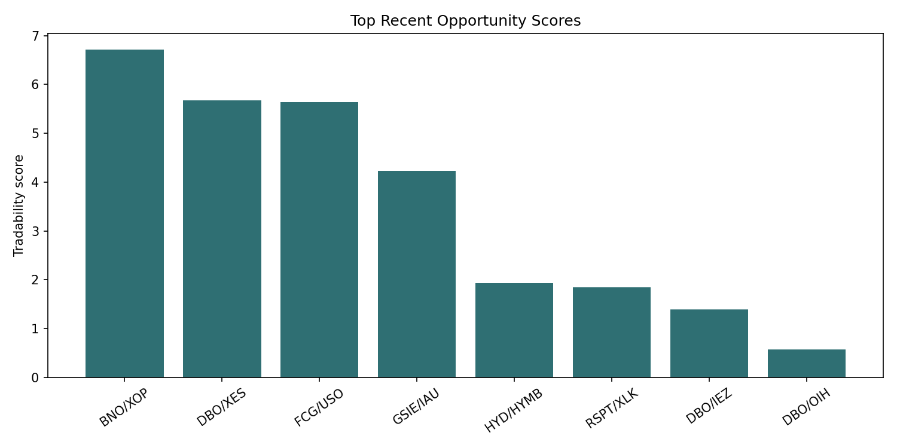
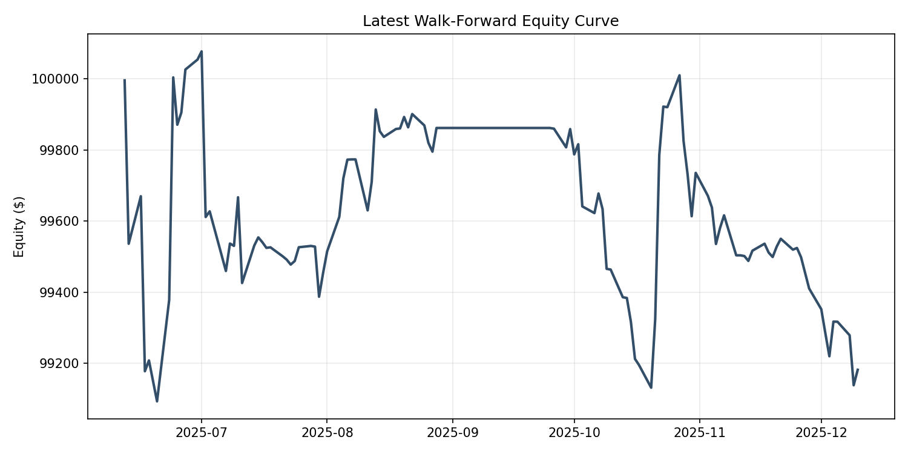
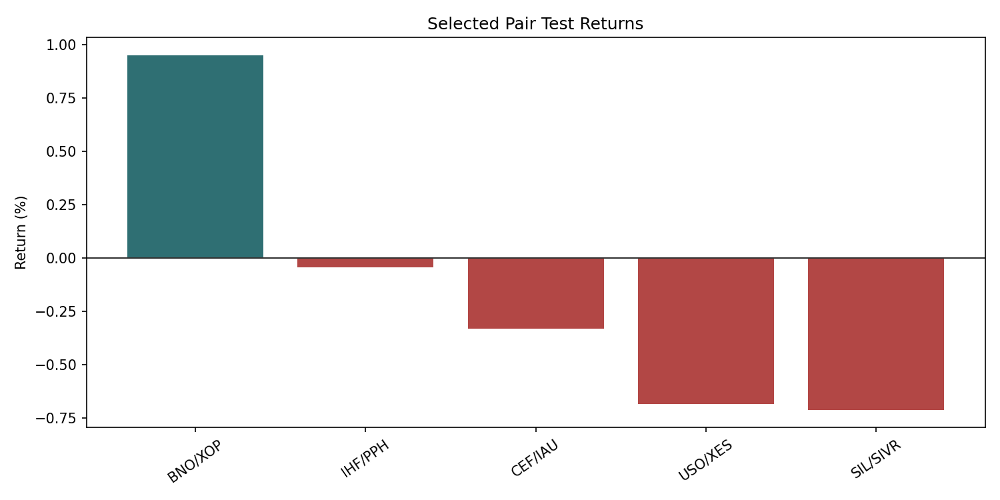
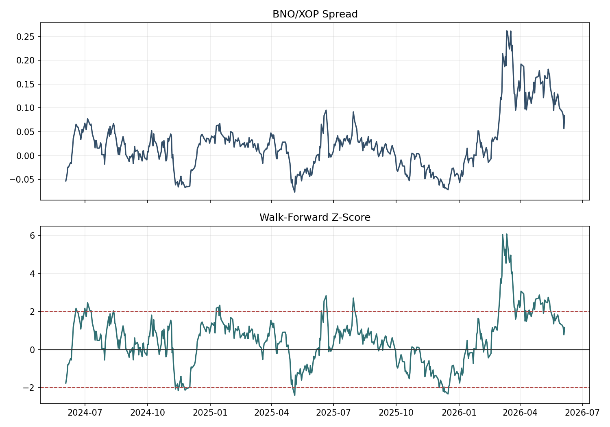

# ETF Pairs Trading MVP Report

## Executive Summary

This project is an ETF pairs-trading research engine. It builds a liquid ETF universe, generates economically related candidate pairs, tests cointegration, ranks recent opportunities by train/validation trading quality, and runs walk-forward out-of-sample checks.

The current MVP does not claim a production-ready trading strategy. Its main finding is that ETF pair relationships are regime-dependent: full-sample cointegration is very selective, while recent validation winners can still fail in the next window. The pipeline is useful because it makes those failures visible instead of hiding them.

The most promising direction from the current run is not a broader model search. It is a focused follow-up on energy commodity/producer relationships, because BNO/XOP was the only selected pair with a positive walk-forward result and has a clear economic link between crude oil exposure and oil producer equities.

## Latest Run Snapshot

- Universe ETFs: 1,666
- Liquid ETFs: 211
- Candidate pairs: 791
- Full-sample cointegration pass count: 7
- Recent opportunity rows: 8
- Latest walk-forward return: -0.82%
- Latest walk-forward Sharpe: -0.81
- Latest walk-forward max drawdown: -0.95%
- Full-history portfolio return: 3.61%
- Full-history portfolio Sharpe: 1.00

## Top Recent Opportunities

| ticker_a | ticker_b | candidate_tier | group | recent_tradability_score | recent_validation_completed_trades | recent_validation_total_return | recent_validation_sharpe | recent_validation_avg_net_pnl_bps |
| --- | --- | --- | --- | --- | --- | --- | --- | --- |
| BNO | XOP | same_subgroup | energy | 6.71 | 3 | 0.93% | 2.17 | 334.53 |
| DBO | XES | same_subgroup | energy | 5.67 | 4 | 0.96% | 2.05 | 240.91 |
| FCG | USO | same_subgroup | energy | 5.64 | 3 | 0.59% | 2.37 | 238.95 |
| GSIE | IAU | same_subgroup | metals | 4.23 | 3 | 0.55% | 1.76 | 181.79 |
| HYD | HYMB | same_subgroup | municipal | 1.92 | 6 | 0.04% | 1.22 | 6.68 |
| RSPT | XLK | same_subgroup | sector | 1.84 | 3 | 0.13% | 1.16 | 42.72 |
| DBO | IEZ | same_subgroup | energy | 1.39 | 4 | 0.19% | 0.49 | 47.63 |
| DBO | OIH | same_subgroup | energy | 0.56 | 4 | 0.06% | 0.13 | 14.90 |

## Latest Walk-Forward Selected Pairs

| ticker_a | ticker_b | group | candidate_tier | validation_tradability_score | train_validation_total_return | train_validation_sharpe |
| --- | --- | --- | --- | --- | --- | --- |
| USO | XES | energy | same_subgroup | 5.89 | 0.84% | 2.11 |
| BNO | XOP | energy | same_subgroup | 4.28 | 0.61% | 1.52 |
| IHF | PPH | sector__industry | sector_industry | 2.05 | 0.30% | 0.61 |
| SIL | SIVR | metals | same_subgroup | 1.66 | 0.21% | 0.66 |
| CEF | IAU | metals | same_subgroup | 0.54 | 0.03% | 0.19 |

## Latest Test Results By Pair

| ticker_a | ticker_b | group | completed_trades | total_return | sharpe | max_drawdown |
| --- | --- | --- | --- | --- | --- | --- |
| BNO | XOP | energy | 3 | 0.95% | 2.18 | -0.32% |
| IHF | PPH | sector__industry | 1 | -0.04% | -0.16 | -0.33% |
| CEF | IAU | metals | 2 | -0.33% | -2.21 | -0.39% |
| USO | XES | energy | 5 | -0.68% | -1.10 | -0.94% |
| SIL | SIVR | metals | 6 | -0.71% | -2.35 | -0.75% |

## Best Current Test Pair

- Pair: BNO/XOP
- Test return: 0.95%
- Test Sharpe: 2.18
- Max drawdown: -0.32%

## Charts

## Methodology

1. Build a broad ETF universe from Nasdaq Trader listings.
2. Filter for liquidity, price, history length, missing data, and non-leveraged exposure.
3. Generate candidate pairs within same subgroups and related economic themes.
4. Run Engle-Granger cointegration and ADF tests as statistical screens.
5. Rank recent opportunities using subtrain/validation trading quality rather than only full-sample p-values.
6. Test selected pair/rule combinations out-of-sample in a walk-forward window.
7. Report portfolio-level and pair-level results.

## Key Finding

The research funnel found some promising individual relationships, especially in energy producer/commodity-style pairs such as BNO/XOP. However, forcing a broader portfolio can dilute those winners with weaker pairs. The next research step is to improve selection confidence, likely by choosing fewer higher-conviction pairs and adding entry confirmation so the strategy avoids fading spreads that are still trending.

A practical next research branch is an energy-focused experiment: build a smaller universe of oil, broad commodity, energy producer, oil services, and exploration/production ETFs; walk-forward test all economically related pairs in that subset; and evaluate whether BNO/XOP is an isolated winner or part of a repeatable theme.

## MVP Limitations

- yfinance daily data is suitable for research, not live execution.
- Bid/ask spreads, intraday fills, financing, borrow constraints, and taxes are simplified.
- Validation windows still have small trade counts.
- HMM filtering reduces bad trades but can become too selective.
- Current profitability is not robust enough for production trading.

## Suggested Next Steps

1. Run a focused energy/commodity-producer experiment around BNO/XOP-like relationships.
2. Walk-forward test all pairs in that smaller energy universe instead of relying only on the broad ETF selector.
3. Test smaller portfolios, such as top 1-3 high-conviction pairs, instead of forcing 5.
4. Add entry confirmation: wait for z-score to start reverting before entering.
5. Run more rolling folds on the 10-year dataset.
6. Improve pair metadata with richer ETF categories, AUM, fees, and issuer data.
7. Add realistic slippage and bid/ask cost modeling before any live trading.
