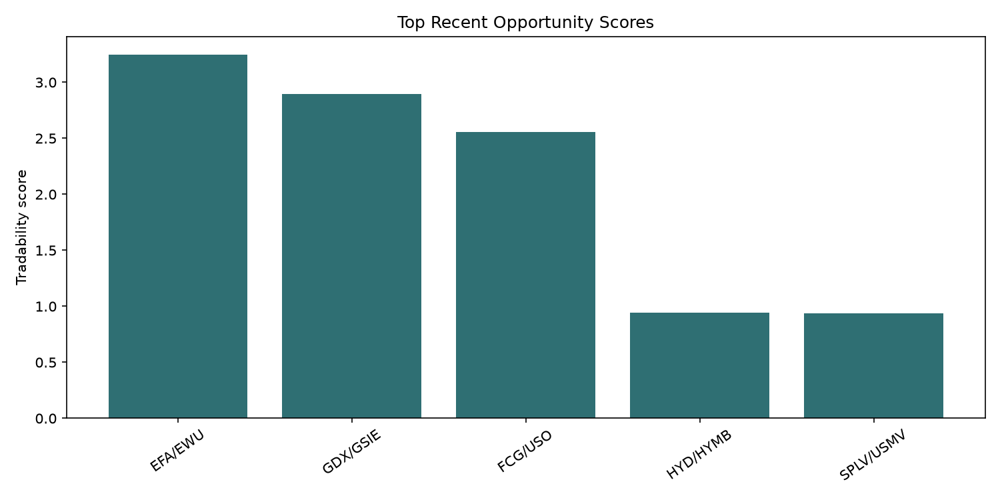
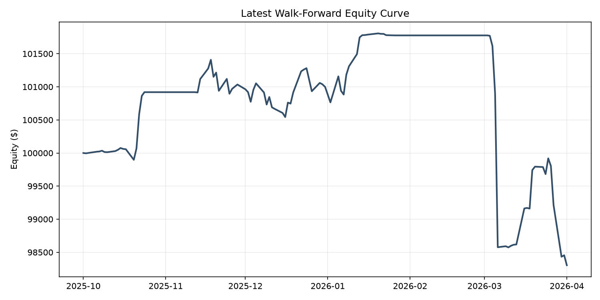
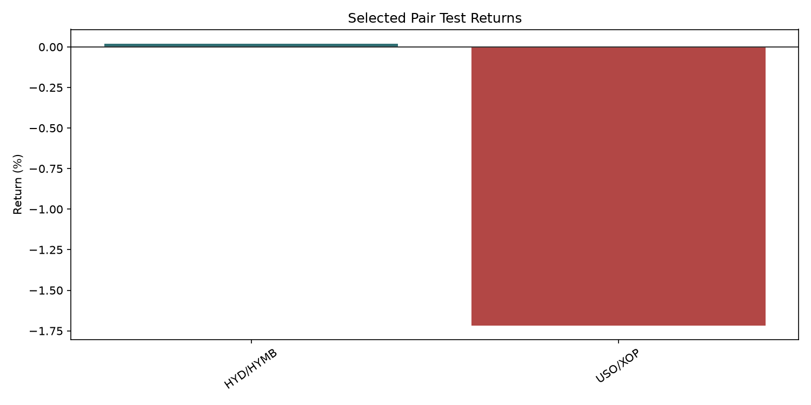
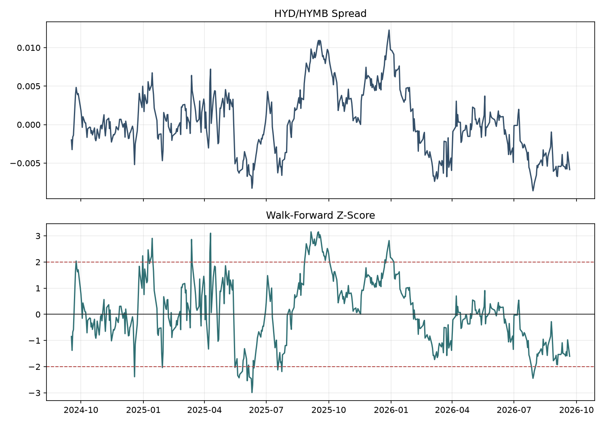

# ETF Pairs Trading MVP Report

Execution contract: signal at completed close t, fixed-share fills at t+1 close, session-based holding limits, daily marks and explicit test-boundary liquidation. Full simultaneous fills are a benchmark; partial-fill risk is modeled separately.

## Executive Summary

This project is an ETF pairs-trading research engine. It builds a liquid ETF universe, generates economically related candidate pairs, tests cointegration, ranks recent opportunities by train/validation trading quality, and runs walk-forward out-of-sample checks.

The current MVP does not claim a production-ready trading strategy. Its main finding is that ETF pair relationships are regime-dependent: full-sample cointegration is very selective, while recent validation winners can still fail in the next window. The pipeline is useful because it makes those failures visible instead of hiding them.

Strategy conclusions must be based on the tables from this run. Earlier saved findings used the legacy execution model and are not carried forward.

## Latest Run Snapshot

- Universe ETFs: 1,666
- Liquid ETFs: 162
- Candidate pairs: 459
- Full-sample cointegration pass count: 2
- Recent opportunity rows: 5
- Latest walk-forward return: -1.70%
- Latest walk-forward Sharpe: -0.77
- Latest walk-forward max drawdown: -3.44%
- Full-history portfolio return: 2.60%
- Full-history portfolio Sharpe: 0.46

## Top Recent Opportunities

| ticker_a | ticker_b | candidate_tier | group | recent_tradability_score | recent_validation_completed_trades | recent_validation_total_return | recent_validation_sharpe | recent_validation_avg_net_pnl_bps |
| --- | --- | --- | --- | --- | --- | --- | --- | --- |
| EFA | EWU | country_region | single_country__international_equity | 3.25 | 7 | 0.18% | 2.12 | 25.33 |
| GDX | GSIE | same_subgroup | metals | 2.89 | 3 | 0.38% | 1.01 | 125.45 |
| FCG | USO | same_subgroup | energy | 2.56 | 3 | 0.38% | 0.68 | 125.54 |
| HYD | HYMB | same_subgroup | municipal | 0.94 | 3 | 0.03% | 0.71 | 8.34 |
| SPLV | USMV | same_subgroup | factor | 0.94 | 5 | 0.04% | 0.42 | 8.85 |

## Latest Walk-Forward Selected Pairs

| ticker_a | ticker_b | group | candidate_tier | validation_tradability_score | train_validation_total_return | train_validation_sharpe |
| --- | --- | --- | --- | --- | --- | --- |
| USO | XOP | energy | same_subgroup | 5.90 | 0.91% | 1.70 |
| HYD | HYMB | municipal | same_subgroup | 2.15 | 0.06% | 1.13 |

## Latest Test Results By Pair

| ticker_a | ticker_b | group | completed_trades | total_return | sharpe | max_drawdown |
| --- | --- | --- | --- | --- | --- | --- |
| HYD | HYMB | municipal | 3 | 0.02% | 0.20 | -0.13% |
| USO | XOP | energy | 7 | -1.72% | -0.79 | -3.41% |

## Best Current Test Pair

- Pair: HYD/HYMB
- Test return: 0.02%
- Test Sharpe: 0.20
- Max drawdown: -0.13%

## Charts

## Methodology

1. Build a broad ETF universe from Nasdaq Trader listings.
2. Filter for liquidity, price, history length, missing data, and non-leveraged exposure.
3. Generate candidate pairs within same subgroups and related economic themes.
4. Run Engle-Granger cointegration and ADF tests as statistical screens.
5. Rank recent opportunities using subtrain/validation trading quality rather than only full-sample p-values.
6. Test selected pair/rule combinations out-of-sample in a walk-forward window.
7. Report portfolio-level and pair-level results.

## Key Finding

The selected walk-forward test returned -1.70%, with Sharpe -0.77 and maximum drawdown -3.44%. This sample does not establish durable profitability; the selected pairs and results above describe only this run.

## MVP Limitations

- yfinance daily data is suitable for research, not live execution.
- Bid/ask spreads, intraday fills, financing, borrow constraints, and taxes are simplified.
- Validation windows still have small trade counts.
- HMM is optional; disabled runs provide no evidence about its effectiveness.
- Limited walk-forward coverage and a present-day universe do not establish production profitability; see historical_rerun_2026-09-22.md for this snapshot’s scope and provenance.

## Suggested Next Steps

1. Validate the daily read-only Alpaca reconciliation and transactional outbox over several actual paper-account dry runs.
2. Resolve share sizing, closing-auction eligibility, corporate actions and actual-fill accounting before adding a separate paper submission worker.
3. Paper trade for several weeks before adding more modeling. Offline fixtures do not satisfy this operating gate.
