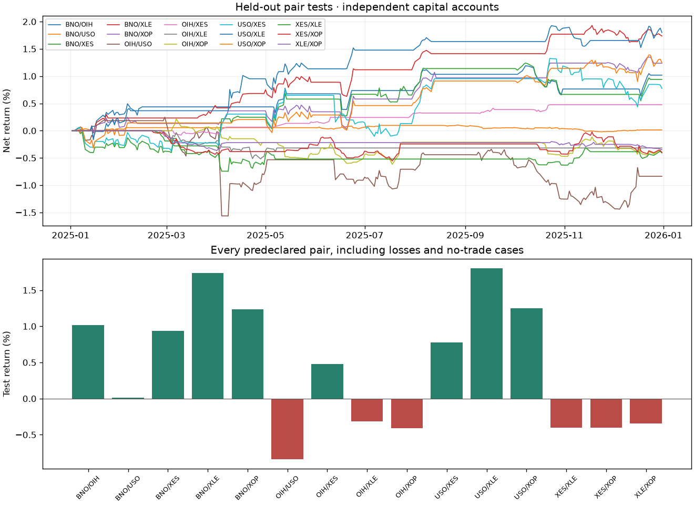

# 001_rolling_ols_baseline

Rolling log-price OLS with validation-selected parameters and the shared next-session engine.

Code commit: `2dda56805903bc23c58f25e34db0fede5bba4285`. Foundation: `research-engine-v1` (`287c41d258e79d15476aa25192a70bd5a1078855`).
Committed source/inputs: True. See [manifest](manifest.json) for checksums, dependencies and the complete configuration.

Universe: BNO, OIH, USO, XES, XLE, XOP. All 15 unordered pairs were tested; 4 parameter combinations per pair.
Validation: 2024-01-02 to 2024-12-31. Test: 2025-01-02 to 2025-12-31.
Positive test returns: 9/15; median pair return: 0.48%. These are separate pair accounts, not portfolio performance.

| Pair | Formation | Entry z | Test return | Sharpe | Max drawdown | Trades |
| --- | ---: | ---: | ---: | ---: | ---: | ---: |
| BNO/OIH | 126 | 2 | 1.02% | 1.30 | -0.55% | 8 |
| BNO/USO | 252 | 1.5 | 0.01% | 0.11 | -0.13% | 7 |
| BNO/XES | 126 | 1.5 | 0.94% | 0.85 | -0.69% | 13 |
| BNO/XLE | 252 | 1.5 | 1.74% | 2.26 | -0.36% | 9 |
| BNO/XOP | 252 | 1.5 | 1.24% | 1.49 | -0.44% | 7 |
| OIH/USO | 126 | 1.5 | -0.84% | -0.47 | -1.81% | 13 |
| OIH/XES | 252 | 1.5 | 0.48% | 2.27 | -0.08% | 7 |
| OIH/XLE | 252 | 2 | -0.32% | -0.91 | -0.52% | 3 |
| OIH/XOP | 126 | 2 | -0.41% | -0.69 | -0.83% | 14 |
| USO/XES | 252 | 1.5 | 0.77% | 0.62 | -0.88% | 13 |
| USO/XLE | 126 | 2 | 1.80% | 1.89 | -0.39% | 8 |
| USO/XOP | 126 | 1.5 | 1.25% | 1.28 | -0.39% | 8 |
| XES/XLE | 126 | 2 | -0.40% | -0.69 | -0.75% | 14 |
| XES/XOP | 126 | 2 | -0.40% | -0.74 | -0.56% | 14 |
| XLE/XOP | 126 | 2 | -0.35% | -1.70 | -0.37% | 5 |

## Protocol

OLS refits each session using only its prior formation window. Initial formation precedes validation; rolling estimates may use earlier validation/test closes as they become observable. Hyperparameters are chosen per pair by maximum validation net return, with deterministic canonical-JSON tie breaking. No test result changes that choice.

Validation and test start flat and liquidate at their own declared endpoints. Fixed shares use signal-close prices and fill at the following supplied session close. Open trades are marked daily. Whole-pair simultaneous fills, fractional adjusted research units and the configured turnover cost are assumed; this experiment makes no broker calls.

Round-trip cost: 4 bps (half on entry turnover, half on exit turnover). Initial capital per independent pair: $100,000; entry gross budget: $10,000.

## Artifacts

- [Validation grid](results/validation_grid.csv)
- [Selected parameters](results/selected_parameters.csv)
- [Test metrics](results/test_metrics.csv)
- [Daily marks](results/test_daily.csv)
- [Trade ledger](results/test_trades.csv)

## Limits

- Retrospective fixed universe, not point-in-time membership.
- Held-out for this parameter selection, not a pristine unseen market sample; earlier project work inspected overlapping dates.
- Downloaded adjusted history can include later corporate-action revisions.
- No cointegration or HMM filter; all unordered universe pairs are reported.
- Simple fixed costs omit borrow, financing and variable slippage.
- Pair tests are independent; overlapping ticker exposures are not a tradeable portfolio.
- One validation/test split; multiple comparisons and regime sensitivity remain.
